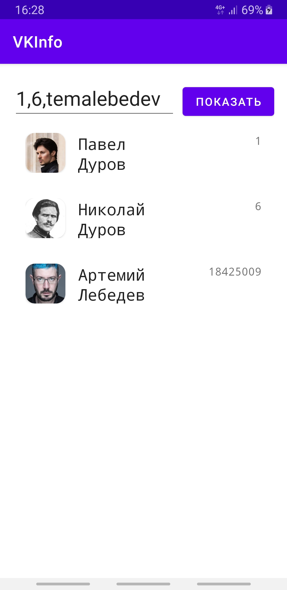
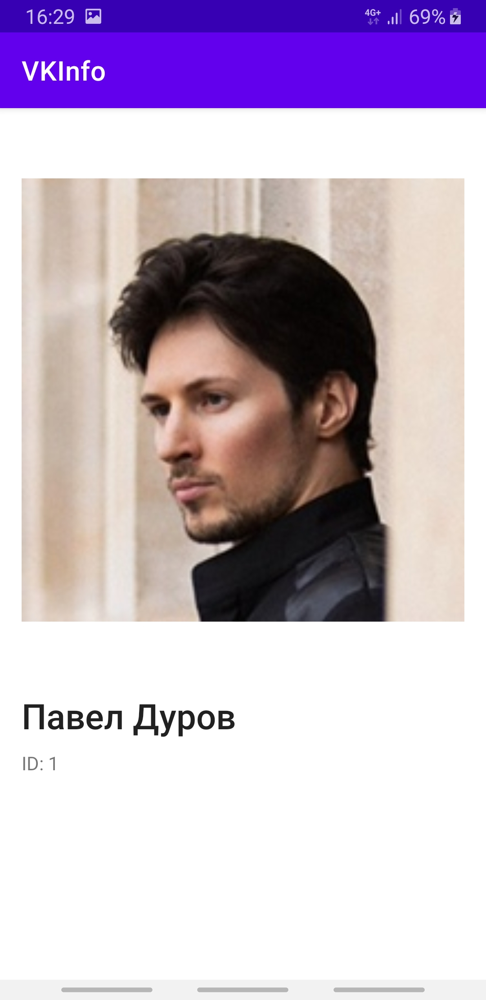

# VKInfo
## Что делает это приложение?
Это приложение обращается к API Вконтакте и получает от него id, имя, фамилию и ссылку на аватар пользователя. Этими данными наполняется RecyclerView, формируется список (фото + фамилия и имя). По тапу на элементе списка открывается вторая активити с "карточкой пользователя": большая фотография, фамилия, имя, ID Вконтакте.

## Как работать с приложением?
В текстовом поле через запятую укажите ID пользователей (можно указывать и числа, и текстовые значения).

## Что-то у меня не работает...
Скорее всего, нужно указать свой токен в методе generateURL файла NetworkUtils.java (https://github.com/StepanMe/VKInfo/blob/master/app/src/main/java/com/example/vkinfo/utils/NetworkUtils.java).
